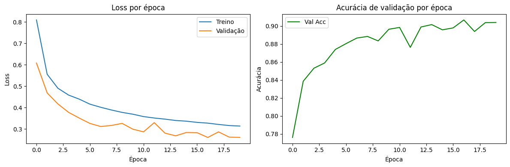
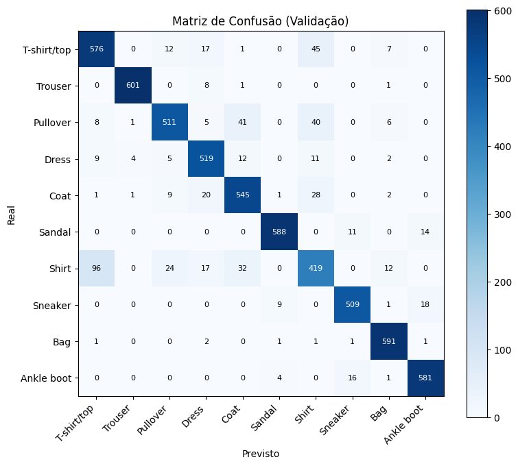
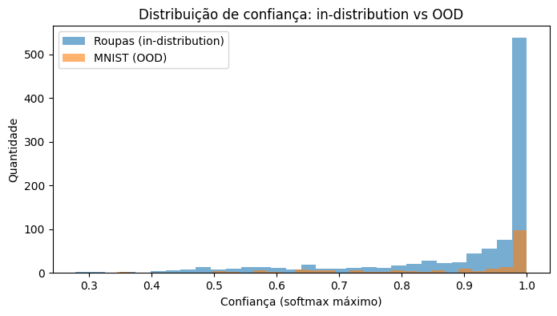

# FashionMNIST-RobustCNN

A Convolutional Neural Network (CNN) developed with PyTorch for image classification on the FashionMNIST dataset. The project also explores a basic Out-of-Distribution (OOD) detection approach using softmax confidence thresholding.

---

## Features

- Convolutional Neural Network (CNN)
- FashionMNIST image classification
- Out-of-Distribution (OOD) detection
- Data augmentation
- Batch Normalization
- Dropout regularization
- Early Stopping
- Learning Rate Scheduler
- Confusion Matrix
- Classification Report
- AUROC evaluation
- Prediction export to CSV

---

## Model Architecture

```text
Input (28×28)

↓

Conv2D (32)
BatchNorm
ReLU
MaxPool

↓

Conv2D (64)
BatchNorm
ReLU
MaxPool

↓

Conv2D (128)
BatchNorm
ReLU
AdaptiveAvgPool

↓

Dropout

↓

Linear (128 → 64)

↓

ReLU

↓

Dropout

↓

Linear (64 → 10)
```

---

## Dataset

### In-Distribution

- FashionMNIST
- 54,000 training images
- 6,000 validation images

### Out-of-Distribution

- MNIST
- 200 images used exclusively for OOD evaluation

Datasets are automatically downloaded using `torchvision`.

---

## Training Configuration

| Parameter | Value |
|-----------|-------|
| Optimizer | Adam |
| Learning Rate | 0.001 |
| Weight Decay | 1e-4 |
| Batch Size | 64 |
| Epochs | 20 |
| Early Stopping | Patience = 5 |
| Scheduler | ReduceLROnPlateau |
| Dropout | 0.30 |

---

## Results

| Metric | Value |
|--------|------:|
| Validation Accuracy | **90.67%** |
| Trainable Parameters | **102,026** |
| Number of Classes | 10 |
| OOD Method | Softmax Confidence Threshold |
| Evaluation Metrics | AUROC and Balanced Accuracy |

### Training Curves



Training and validation performance during model training.

---

### Confusion Matrix



Confusion matrix obtained on the validation dataset.

---

### OOD Confidence Distribution



Confidence distributions for in-distribution and out-of-distribution samples.

---

## Technologies

- Python
- PyTorch
- Torchvision
- NumPy
- Matplotlib
- Scikit-learn

---

## Installation

Clone the repository:

```bash
git clone https://github.com/Dioguinho-max/FashionMNIST-RobustCNN.git
cd FashionMNIST-RobustCNN
```

Install the dependencies:

```bash
pip install -r requirements.txt
```

Run the notebook or the Python script.

---

## Repository Structure

```text
FashionMNIST-RobustCNN/
│
├── images/
│   ├── training_curves.png
│   ├── confusion_matrix.png
│   └── ood_distribution.png
│
├── model.py
├── melhor_modelo.pth
├── predicoes.csv
├── requirements.txt
├── LICENSE
└── README.md
```

---

## Future Work

- Energy-based OOD detection
- Mahalanobis distance
- Temperature scaling
- ResNet architectures
- Confidence calibration
- Larger benchmark datasets

---

## About

This repository contains my first Deep Learning project built with PyTorch.

The objective was to understand the complete deep learning workflow, including data preprocessing, CNN design, regularization techniques, model evaluation, and basic Out-of-Distribution detection.

Although developed as a learning project, it follows several good deep learning practices such as Batch Normalization, Dropout, Early Stopping, Learning Rate Scheduling, and comprehensive evaluation metrics.

---

## License

This project is licensed under the GNU General Public License v3.0 (GPL-3.0).
